# Intro

This repository contains the code for the paper "[Skill Machines: Temporal Logic Skill Composition in Reinforcement Learning](https://openreview.net/pdf?id=qiduMcw3CU)". The paper introduces a new framework where an agent first learns a sufficient set of skill primitives to achieve all relevant high-level goals in its environment. The agent can then flexibly compose them both logically and temporally to provably achieve temporal logic specifications in any regular language, such as regular fragments of linear temporal logic.

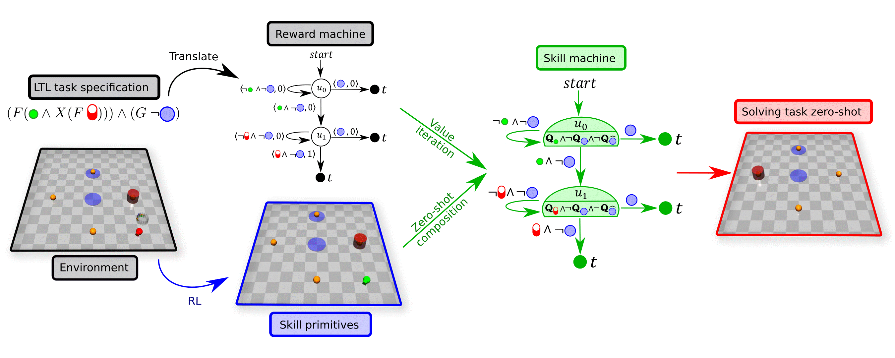

## Supported RL Algorithms and General Usage

Skill machines are compatible with any RL Algorithm. This repo is structured such that given any Gymnasium environment (env) with a set of predicates $\mathcal{P}$ (env.predicates) and a labeling function $L:\mathcal{S}\to2^\mathcal{P}$ (env.get_predicates()), we can simply use the Task wrapper in [rm.py](rm.py) to define a temporal logic task in the environment, use the TaskPrimitive wrapper in [sm.py](sm.py) to learn all the skill primitives in the environment, and use the SkillMachine wrapper in [sm.py](sm.py) to generate the skill machine for the given task. See [sm_ql.py](sm_ql.py) for an example usage with vanilla Q-learning in a tabular environment like the Office-World. 

Using this framework, an agent can learn the sufficient skill primitives to solve a distribution of complex long-horizon tasks such has "Deliver mail to the office until there is no mail left, then deliver coffee to office while there are people in the office, then patrol rooms A-B-C-D-A, and never break a decoration":

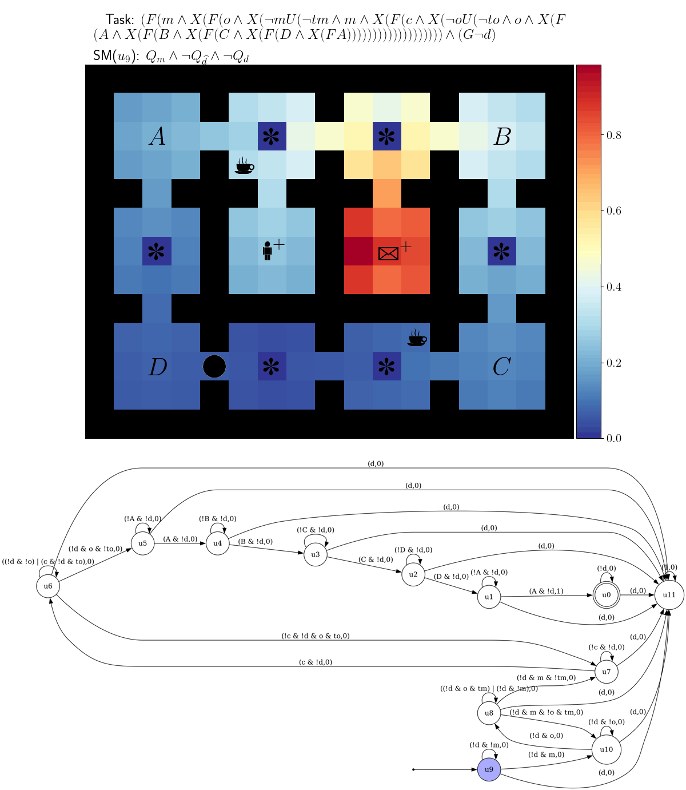

## Installation

This code has been tested in Ubuntu >= 20.04 LTS

Install the required packages:
```
conda create --name sm python==3.8
conda activate sm
pip install -r requirements.txt
```

Install the spot library for handling LTL and automata task specifications:
```
conda install -c conda-forge spot
```

To run the Safety-Gym experiments, you need to install Openai mujoco-py by following the instructions in: [https://github.com/openai/mujoco-py](https://github.com/openai/mujoco-py). 
Then install [Safety-Gym](https://github.com/openai/safety-gym) as follows:
```
cd envs/safety_gym/safety-gym
pip install -e .
```

The baselines in the paper use the code base from Icarte et al.: [https://github.com/RodrigoToroIcarte/reward_machines](https://github.com/RodrigoToroIcarte/reward_machines).  
To be able to run them, instead install the following required packages:
```
cd baselines_iclr
pip install -r requirements.txt
```

## Reproduce Experiments from Paper
```
bash baselines_iclr/run_office.sh
bash baselines_iclr/run_sb3.sh
```
```
python plots.py --exp office_iclr --env Office-Coffee-Task-v0 --metric "eval total reward"
python plots.py --exp moving_iclr
```

## Getting Started

**Reward machines and Tasks:** 
The file [rm.py](rm.py) contains a simple RewardMachine Gymnasium env for defining reward machines based on LTL or automata specifications (by using the [spot](https://spot.lrde.epita.fr/app/) library).
The file [rm.py](rm.py) also contains a simple Task wrapper for defining Tasks in an environment given an LTL or automata specifications (by taking the "cross-product" between the corresponding reward machine and the environment).
For example:
```
import gymnasium as gym, envs
from rm import Task

task_env = Task(gym.make("Office-v0"), ltl="F(c & X Fo) & G~d") # Coffee task from LTL specification
task_env = Task(gym.make("Office-v0"), hao="example_task_automata.hao") # Coffee task from automata specification
```

**Manual control using keyboard:** Examples
```
python manual_control.py --env Safety-v0 
python manual_control.py --env MovingTargets-Task-2-v0
python manual_control.py --env Office-v0 --ltl "F(c & X(F o)) & G(~d)"
```
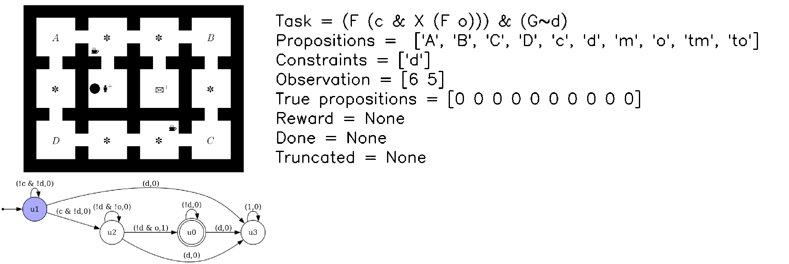

**To pretrain skill primitives:**
```
python sm_ql.py --env Office-v0
```
**To train skill primitives while evaluating on task distribution:**
```
python sm_ql.py --env Office-CoffeeMail-Task-v0 --total_steps 400000 --sp_dir data/sp_ql/Office-v0/ --log_dir data/logs/sm_ql/Office-CoffeeMail-Task-v0/
```
**Zeroshot transfer with pretrained skill primitives:**
```
python sm_ql.py --env Office-CoffeeMail-Task-v0 --total_steps 400000 --zeroshot --load --sp_dir data/sp_ql/Office-v0/ --log_dir data/logs/sm_ql/zeroshot/Office-CoffeeMail-Task-v0/
```
**Fewshot transfer with pretrained skill primitives:**
```
python sm_ql.py --env Office-CoffeeMail-Task-v0 --total_steps 400000 --fewshot --load --sp_dir data/sp_ql/Office-v0/ --log_dir data/logs/sm_ql/zeroshot/Office-CoffeeMail-Task-v0/
```
**Baseline Q-learning:**
```
python ql.py --env Office-CoffeeMail-Task-v0 --total_steps 400000 --log_dir data/logs/ql/Office-CoffeeMail-Task-v0/
```

<table>
<!--   <tr>
    <td> <div style="position: absolute; top: 50%; right: 50%;">Success rate: Coffee Task</div> </td>
    <td> <div style="position: absolute; top: 50%; right: 50%;">Discounted rewards: Coffee Task</div> </td>
  </tr>    -->
  <tr>
    <td> <div style="position: absolute; top: 50%; right: 50%;">Office-CoffeeMail-Task-v0: Success rate</div> </td>
    <td> <div style="position: absolute; top: 50%; right: 50%;">Office-CoffeeMail-Task-v0: Discounted rewards</div> </td>
  </tr>   
</table>

**To visualise trained policies:**
```
python enjoy.py --algo ql --env Office-CoffeeMail-Task-v0 --sp_dir data/Office-v0/
python enjoy.py --algo ql --env Office-CoffeeMail-Task-v0 --q_dir data/sm_ql/Office-CoffeeMail-Task-v0/ --fewshot
```
<table>
  <tr>
    <td> <div style="position: absolute; top: 50%; right: 50%;">Office-CoffeeMail-Task-v0: Zeroshot (SM)</div> 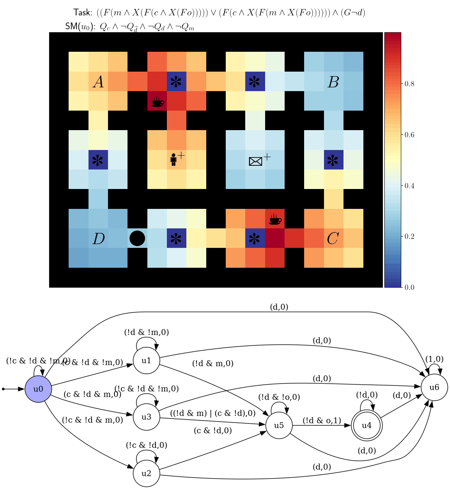</td>
    <td> <div style="position: absolute; top: 50%; right: 50%;">Office-CoffeeMail-Task-v0: Fewshot (SM-QL)</div> 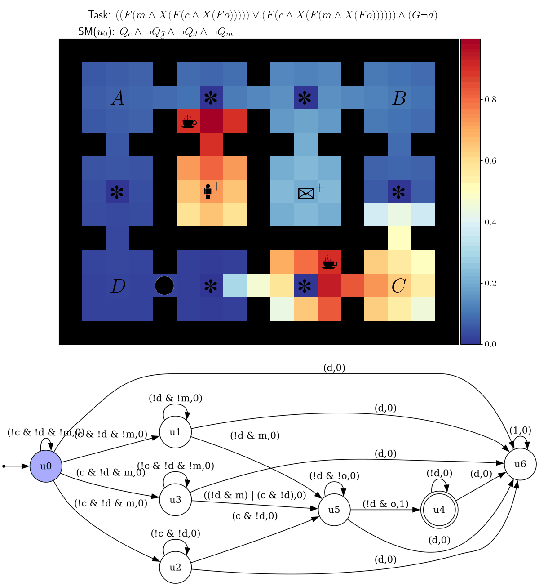</td>
  </tr>   
</table>

**Function approximation examples:**
```
python sm_sb3.py --algo dqn --env MovingTargets-v0 --sp_dir data/MovingTargets-v0/
python sm_sb3.py --algo td3 --env Safety-Multi-Task-v0 --sp_dir data/Safety-v0/
python sb3.py --algo td3 --env Safety-Multi-Task-v0
```
<table>
  <tr>
    <td> <div style="position: absolute; top: 50%; right: 50%;">MovingTargets-Task-1-v0 <br> F (circle | square) <br> Pick up any object.</div> </td>
    <td> <div style="position: absolute; top: 50%; right: 50%;">MovingTargets-Task-4-v0 <br> F((~square & blue) & X(F(square & ~ blue))) <br> Pick up non-square blue objects, then non-blue squares in that order.</div> </td>
  </tr>   
  <tr>
    <td> <div style="position: absolute; top: 50%; right: 50%;">MovingTargets-Multi-Task-v0 (Tasks 1-4 sampled randomly)</div> </td>
    <td> <div style="position: absolute; top: 50%; right: 50%;">Safety-Multi-Task-v0 (Tasks 1-6 sampled randomly)</div> </td>
  </tr>   
</table>

```
python enjoy.py --algo dqn --env MovingTargets-Task-1-v0 --sp_dir data/MovingTargets-v0/
python enjoy.py --algo dqn --env MovingTargets-Task-4-v0 --sp_dir data/MovingTargets-v0/
```

<table>
  <tr>
    <td> <div style="position: absolute; top: 50%; right: 50%;">MovingTargets-Task-1-v0 <br> F (circle | square) <br> Pick up any object. Repeat forever.</div> 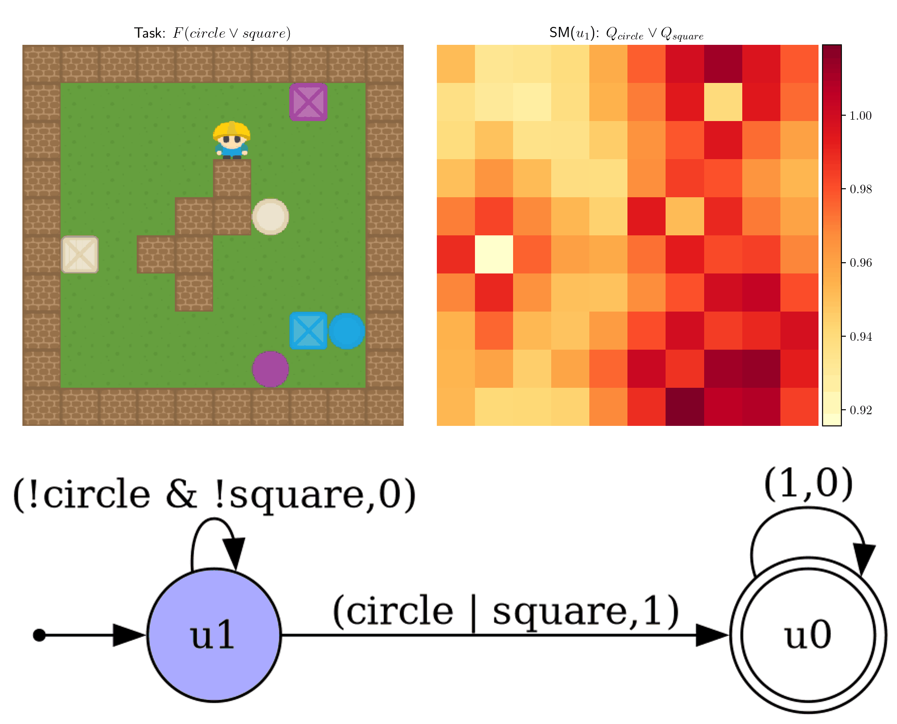</td>
    <td> <div style="position: absolute; top: 50%; right: 50%;">MovingTargets-Task-4-v0 <br> F((~square & blue) & X(F(square & ~ blue))) <br> Pick up non-square blue objects, then non-blue squares in that order. Repeat forever.</div> 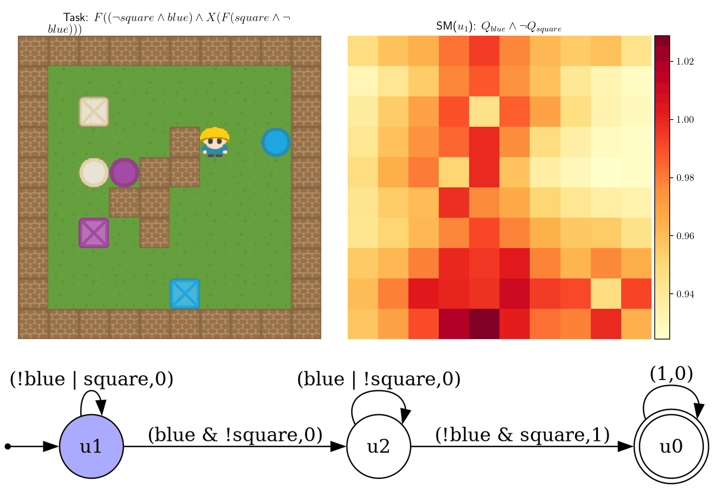</td>
  </tr>   
</table>

```
python enjoy.py --algo td3 --env Safety-Task-1-v0 --sp_dir data/Safety-v0/
python enjoy.py --algo td3 --env Safety-Task-2-v0 --sp_dir data/Safety-v0/
```

<table>
  <tr>
    <td> <div style="position: absolute; top: 50%; right: 50%;">Safety-Task-1-v0 <br> (F (buttons & X (F goal))) <br> Navigate to a button and then to a cylinder.</div> 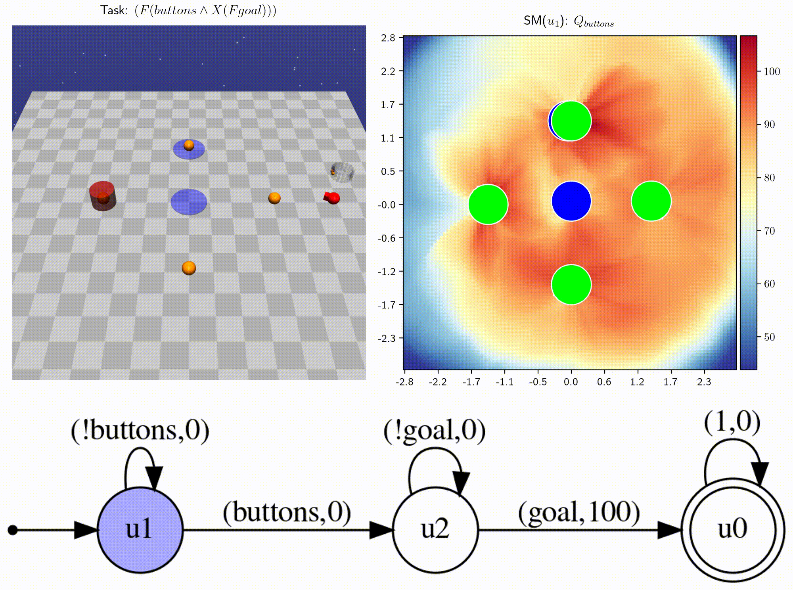</td>
    <td> <div style="position: absolute; top: 50%; right: 50%;">Safety-Task-2-v0 <br> (F (buttons & X (F goal))) & (G~hazards) <br> Navigate to a button and then to a cylinder while never entering blue regions</div> 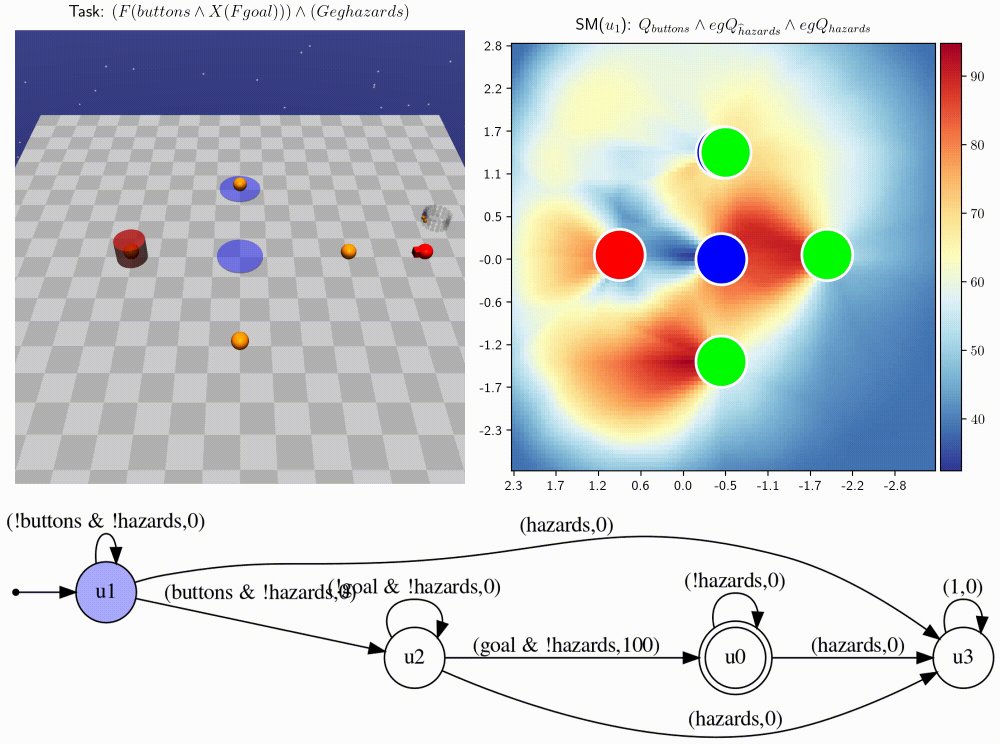</td>
  </tr>   
</table>

```
python enjoy.py --algo td3 --env Safety-Task-3-v0 --sp_dir data/Safety-v0/
python enjoy.py --algo td3 --env Safety-Task-4-v0 --sp_dir data/Safety-v0/
```

<table>
  <tr>
    <td> <div style="position: absolute; top: 50%; right: 50%;">Safety-Task-3-v0 <br> F(buttons & X(F (( goal & ~hazards )&X(F(( buttons & hazards )&X(F goal)))))) : Navigate to a button, then to a cylinder without entering blue regions, then to a button inside a blue region, and finally to a cylinder again.</div> 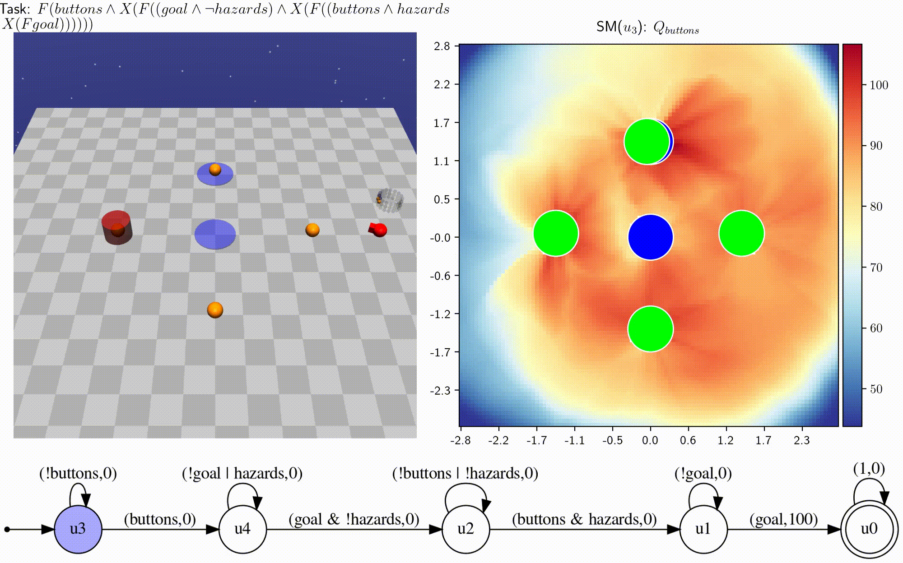</td>
    <td> <div style="position: absolute; top: 50%; right: 50%;">Safety-Task-6-v0 <br> F(hazards & X(F(( buttons & goal) & X ((F goal) & (G ~hazards))))) <br> Navigate to a blue region, then to a button with a cylinder, and finally to a cylinder while avoiding blue regions.</div> 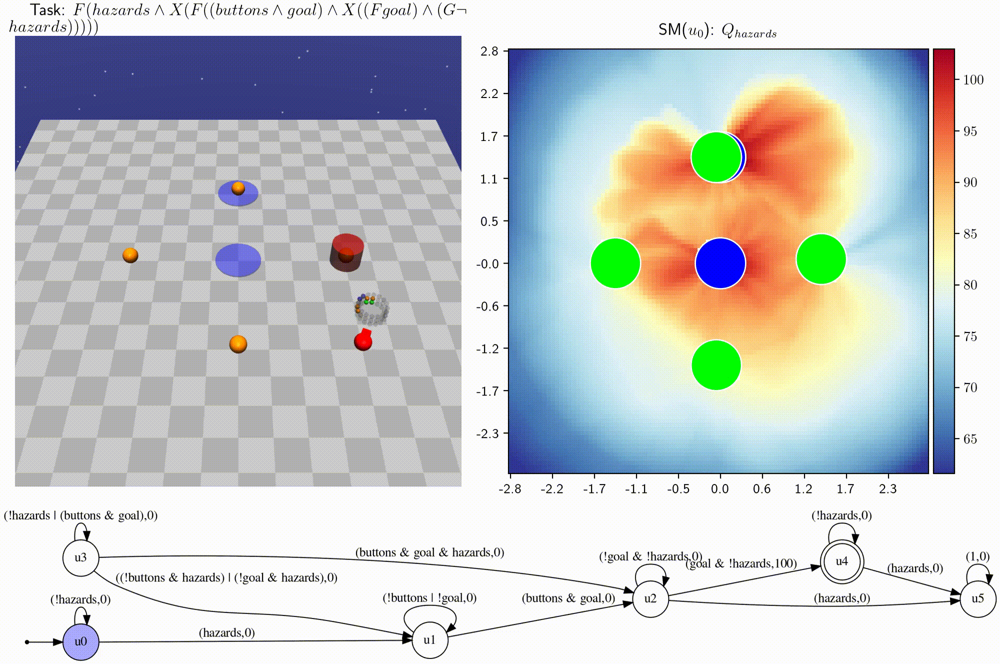</td>
  </tr>   
</table>

## Cite the Paper


```
@inproceedings{tasseskill,
  title={Skill Machines: Temporal Logic Skill Composition in Reinforcement Learning},
  author={Tasse, Geraud Nangue and Jarvis, Devon and James, Steven and Rosman, Benjamin},
  booktitle={The Twelfth International Conference on Learning Representations},
  year = {2024}
}
```
